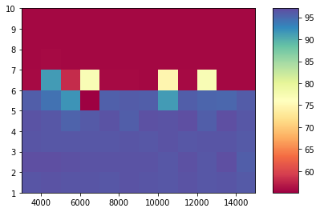
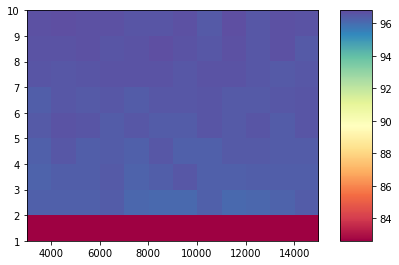

# Введение в искусственные нейронные сети 

## Урок 1

### Задание

Попробуйте видоизменить параметры разобранной на уроке двухслойной нейронной сети таким образом, чтобы улучшить ее точность (число нейронов, число эпох , можно изменять число слоев).

Проведите анализ — что приводит к ухудшению точности нейронной сети? Что приводит к увеличению ее точности?

Диаграма показывает, что при увеличении количества слоев, больше пяти точность существенно падает, при этом увеличение количества эпох более 3000 оказывает незначительное влияние

Диаграма показывает, что при увеличении количества нейронов, больше двух точность возрастает, при этом увеличение количества эпох более 3000 оказывает незначительное влияние
